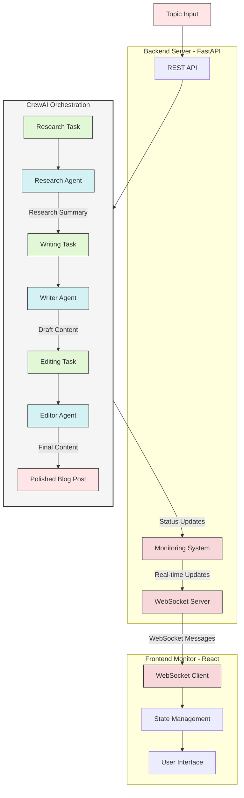

# CrewAI Content Creation Demo

This project demonstrates the use of CrewAI framework to create an automated content creation pipeline using multiple AI agents working together, with real-time monitoring capabilities. The system uses OpenRouter as the LLM provider and includes a modern web interface for monitoring the agents' progress.

## Features

- **Multi-Agent Content Creation**
  - Research Agent: Gathers and analyzes information
  - Writer Agent: Creates engaging content
  - Editor Agent: Polishes and optimizes content
- **Real-Time Monitoring**
  - WebSocket-based live updates
  - Visual status tracking
  - Agent progress visualization
- **Modern Web Interface**
  - React-based frontend
  - Real-time status updates
  - Clean, professional design

## Architecture Overview

The system is composed of three main components that work together to create and monitor the content creation process:



The diagram above shows how the different components interact:
1. The Frontend provides the user interface and real-time monitoring
2. The Backend handles API requests and WebSocket communications
3. The CrewAI Orchestration manages the content creation pipeline with specialized agents

## Prerequisites

- Python 3.8 or higher
- Node.js 16 or higher
- OpenRouter API key (get it from [OpenRouter](https://openrouter.ai/))

## Project Structure

```
.
├── frontend/                # React-based monitoring interface
│   ├── src/
│   │   ├── App.js          # Main application component
│   │   └── App.css         # Styling
│   └── package.json        # Frontend dependencies
├── backend/
│   ├── app/
│   │   └── main.py         # FastAPI server implementation
│   └── requirements.txt    # Backend dependencies
├── agents/
│   ├── research_agent.py   # Research analyst agent
│   ├── writer_agent.py     # Content writer agent
│   └── editor_agent.py     # Content editor agent
├── tasks/
│   └── content_tasks.py    # Task definitions
├── content_creation_crew.py # Main CrewAI script
├── requirements.txt        # Project dependencies
├── run_monitor.sh         # Startup script
├── .env.sample            # Template for environment variables
└── .env                   # Environment variables (not tracked)
```

## Installation

1. Clone the repository:
```bash
git clone https://github.com/your-username/crewai_demo.git
cd crewai_demo
```

2. Create and activate a virtual environment:
```bash
# On macOS/Linux
python -m venv venv
source venv/bin/activate

# On Windows
python -m venv venv
.\venv\Scripts\activate
```

3. Install Python dependencies:
```bash
# Install main project dependencies
pip install -r requirements.txt

# Install backend dependencies
cd backend
pip install -r requirements.txt
cd ..
```

4. Install frontend dependencies:
```bash
cd frontend
npm install
cd ..
```

5. Set up environment variables:
```bash
# Copy the sample environment file
cp .env.sample .env

# Edit .env with your OpenRouter API key
# Replace 'your_api_key_here' with your actual API key
echo "OPENROUTER_API_KEY=your_api_key_here" >> .env
```

## Running the Application

You can run the application in two ways:

### Method 1: Using Separate Terminals (Recommended for Development)

1. Start the backend server (Terminal 1):
```bash
cd backend
uvicorn app.main:app --host localhost --port 8000 --reload
```

2. Start the frontend development server (Terminal 2):
```bash
cd frontend
npm start
```

The application will be available at:
- Frontend: http://localhost:3000
- Backend API: http://localhost:8000
- WebSocket: ws://localhost:8000/ws

### Method 2: Using Process Manager (Recommended for Production)

1. Install PM2 globally:
```bash
npm install -m pm2 -g
```

2. Create an ecosystem file (ecosystem.config.js):
```bash
cd crewai_demo
echo 'module.exports = {
  apps: [
    {
      name: "crewai-backend",
      cwd: "./backend",
      script: "uvicorn",
      args: "app.main:app --host localhost --port 8000",
      interpreter: "./venv/bin/python",
      env: {
        NODE_ENV: "development",
      },
    },
    {
      name: "crewai-frontend",
      cwd: "./frontend",
      script: "npm",
      args: "start",
      env: {
        NODE_ENV: "development",
      },
    },
  ],
};' > ecosystem.config.js
```

3. Start all services:
```bash
pm2 start ecosystem.config.js
```

4. Monitor the services:
```bash
pm2 monit
```

To stop all services:
```bash
pm2 stop all
```

## Usage

1. Open your browser and navigate to http://localhost:3000
2. Enter a topic in the input field
3. Click "Start CrewAI" to begin the content creation process
4. Monitor the progress of each agent in real-time
5. The final content will be displayed when the process is complete

## Configuration

### LLM Configuration

The project uses OpenRouter as the LLM provider. The current configuration uses the following model:

```python
llm = ChatOpenAI(
    model_name='openai/gpt-4-turbo-preview',
    temperature=0.8,
    openai_api_key=os.environ["OPENROUTER_API_KEY"],
    base_url="https://openrouter.ai/api/v1",
    model_kwargs={
        "headers": {
            "HTTP-Referer": "https://github.com/crewai",
            "X-Title": "CrewAI Demo"
        }
    }
)
```

You can modify the model and parameters in `content_creation_crew.py`.

### Available Models

Through OpenRouter, you can use various models:
- openai/gpt-4-turbo-preview
- openai/gpt-3.5-turbo
- anthropic/claude-2
- google/palm-2

See [OpenRouter's documentation](https://openrouter.ai/docs#models) for the complete list.

## Troubleshooting

### Common Issues

1. **WebSocket Connection Errors**
   - Ensure both backend and frontend servers are running
   - Check if port 8000 is available
   - Verify your firewall settings

2. **API Key Issues**
   - Confirm your OpenRouter API key is correctly set in .env
   - Ensure the .env file is in the project root

3. **Node.js Errors**
   - Try clearing npm cache: `npm cache clean --force`
   - Delete node_modules and reinstall: `rm -rf node_modules && npm install`

4. **Python Environment Issues**
   - Ensure you're using the correct virtual environment
   - Try recreating the virtual environment if dependencies conflict

### Getting Help

If you encounter issues:
1. Check the backend logs in the terminal running uvicorn
2. Check the frontend logs in the terminal running npm
3. Check the browser console for frontend errors
4. Open an issue on GitHub with the error details

## Contributing

Contributions are welcome! Please feel free to submit issues and pull requests.

## License

This project is licensed under the MIT License - see the LICENSE file for details. 