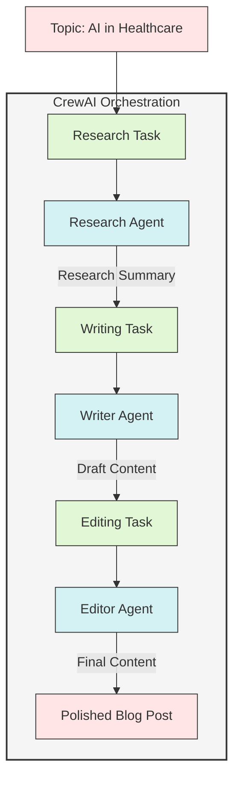

# CrewAI Content Creation Demo

This project demonstrates the use of CrewAI framework to create an automated content creation pipeline using multiple AI agents working together.

## CrewAI SDK Components

### 1. Agent Creation
```python
from crewai import Agent

agent = Agent(
    role='Research Analyst',      # Define agent's role
    goal='Specific objective',    # What the agent aims to achieve
    backstory='Agent context',    # Background that influences behavior
    llm=llm                      # Language model to use
)
```

### 2. Task Definition
```python
from crewai import Task

task = Task(
    description='Task details',   # What needs to be done
    expected_output='Format',     # Expected result format
    agent=agent                   # Agent assigned to task
)
```

### 3. Crew Orchestration
```python
from crewai import Crew

crew = Crew(
    agents=[agent1, agent2],      # List of agents
    tasks=[task1, task2],         # Sequential tasks
    verbose=True                  # Enable detailed output
)

result = crew.kickoff()           # Start the workflow
```

### Key Features

1. **Agent Configuration**
   - Role-based behavior
   - Goal-oriented actions
   - Contextual backstory
   - Customizable LLM integration

2. **Task Management**
   - Clear task descriptions
   - Expected output definitions
   - Agent-task assignment
   - Sequential execution

3. **Crew Coordination**
   - Multi-agent orchestration
   - Task sequencing
   - Information passing
   - Process monitoring

4. **LLM Integration**
   - Supports multiple providers
   - Model configuration
   - API management
   - Response handling

## Agent Workflow



## Key Benefits

1. **Sequential Workflow**: Each agent builds upon the work of the previous agent
2. **Specialized Roles**: Each agent is optimized for its specific task
3. **Coordinated Effort**: CrewAI manages the flow of information between agents
4. **Quality Control**: Each step adds value to the final output
5. **Scalable Process**: Easy to add or modify agents and tasks

## Project Structure

```
.
├── agents/
│   ├── research_agent.py   # Research analyst agent
│   ├── writer_agent.py     # Content writer agent
│   └── editor_agent.py     # Content editor agent
├── tasks/
│   └── content_tasks.py    # Task definitions
├── content_creation_crew.py # Main script
├── requirements.txt        # Project dependencies
├── .env.sample            # Template for environment variables
└── .env                    # Environment variables (not tracked in git)
```

## Setup

1. Clone the repository:
```bash
git clone https://github.com/padak/crewai_demo.git
cd crewai_demo
```

2. Create and activate a virtual environment:
```bash
python -m venv venv
source venv/bin/activate  # On Windows: venv\Scripts\activate
```

3. Install dependencies:
```bash
pip install -r requirements.txt
```

4. Create a `.env` file from the template:
```bash
cp .env.sample .env
```

5. Edit the `.env` file with your OpenRouter API key:
```
OPENROUTER_API_KEY=your_api_key_here
OPENAI_API_BASE=https://openrouter.ai/api/v1
```

You can get your OpenRouter API key from [https://openrouter.ai/](https://openrouter.ai/).

## Usage

Run the content creation pipeline:
```bash
python content_creation_crew.py
```

## How it Works

The project uses three AI agents working together:

1. **Research Agent**: Gathers and analyzes information on the given topic
   - Focuses on credible sources
   - Identifies key trends and insights
   - Provides comprehensive research summary

2. **Writer Agent**: Creates engaging content based on the research
   - Transforms technical information into reader-friendly content
   - Maintains accuracy while ensuring engagement
   - Structures content for maximum impact

3. **Editor Agent**: Reviews and optimizes the content
   - Ensures grammar and clarity
   - Optimizes for SEO
   - Enhances readability and engagement

Each agent has specific tasks and works sequentially to produce the final content.

## Model Configuration

By default, the project uses `gpt-4-turbo` through OpenRouter. You can change the model in `content_creation_crew.py`. Available models include:
- openai/gpt-4-turbo
- openai/gpt-3.5-turbo
- anthropic/claude-2
- google/palm-2

See more models at [OpenRouter's documentation](https://openrouter.ai/docs#models).

## Monitoring and Debugging

### 1. Verbose Mode
```python
crew = Crew(
    agents=[agent1, agent2],
    tasks=[task1, task2],
    verbose=True    # Enable detailed logging
)
```
When verbose is enabled, you'll see:
- Task assignments
- Agent thought processes
- Execution steps
- Output generation

### 2. Process Monitoring
The execution process shows:
```
# Agent: Research Analyst
## Task: [Task description]
## Thought Process:
1. First, I need to...
2. Then, I will...
3. Finally, I'll...

## Working on it...
[Progress updates]

## Final Answer:
[Task output]
```

### 3. Debug Options

#### a. Agent Execution Tracking
```python
agent = Agent(
    role='Research Analyst',
    goal='Research goal',
    backstory='Agent context',
    llm=llm,
    allow_delegation=True,     # Enable task delegation
    verbose=True              # Agent-specific verbose mode
)
```

#### b. Task Progress Monitoring
```python
task = Task(
    description='Task details',
    expected_output='Expected format',
    agent=agent,
    output_handler=lambda output: print(f"Task output: {output}")  # Custom output handling
)
```

### 4. Common Monitoring Patterns

1. **Step-by-Step Execution**
   - Agent identification
   - Task assignment
   - Thought process
   - Work execution
   - Output generation

2. **Information Flow**
   - Input processing
   - Task delegation
   - Inter-agent communication
   - Result passing

3. **Error Handling**
   - Task failures
   - Agent limitations
   - Model errors
   - Recovery attempts

### 5. Monitoring Best Practices

1. **Development Phase**
   - Enable verbose mode
   - Monitor agent interactions
   - Track task completion
   - Debug error cases

2. **Production Phase**
   - Use custom output handlers
   - Implement error logging
   - Monitor performance
   - Track success rates 