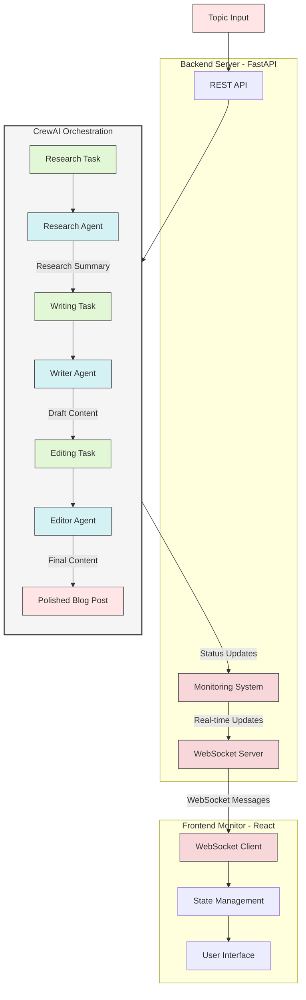

# CrewAI Content Creation Demo

This project demonstrates the use of CrewAI framework to create an automated content creation pipeline using multiple AI agents working together, with real-time monitoring capabilities.

## Architecture Overview



## System Components

### 1. Frontend Monitor
- Real-time agent status visualization
- WebSocket-based live updates
- Task progress tracking
- Professional UI with React
- Grouped message display
- Agent workflow visualization

### 2. Backend Server
- FastAPI-based REST API
- WebSocket server for real-time communication
- Task monitoring and status updates
- Error handling and reconnection logic

### 3. CrewAI Integration
- Agent orchestration
- Task execution
- Progress monitoring
- Status reporting

## Project Structure

```
.
├── frontend/                # React-based monitoring interface
│   ├── src/
│   │   ├── App.js          # Main application component
│   │   └── App.css         # Styling
│   └── package.json        # Frontend dependencies
├── backend/
│   ├── app/
│   │   └── main.py         # FastAPI server implementation
│   └── requirements.txt    # Backend dependencies
├── agents/
│   ├── research_agent.py   # Research analyst agent
│   ├── writer_agent.py     # Content writer agent
│   └── editor_agent.py     # Content editor agent
├── tasks/
│   └── content_tasks.py    # Task definitions
├── content_creation_crew.py # Main CrewAI script
├── requirements.txt        # Project dependencies
├── run_monitor.sh         # Startup script
├── .env.sample            # Template for environment variables
└── .env                   # Environment variables (not tracked)
```

## Setup

1. Clone the repository:
```bash
git clone https://github.com/padak/crewai_demo.git
cd crewai_demo
```

2. Create and activate a virtual environment:
```bash
python -m venv venv
source venv/bin/activate  # On Windows: venv\Scripts\activate
```

3. Install dependencies:
```bash
pip install -r requirements.txt
cd backend && pip install -r requirements.txt
cd ../frontend && npm install
```

4. Create a `.env` file from the template:
```bash
cp .env.sample .env
```

5. Edit the `.env` file with your OpenRouter API key:
```
OPENROUTER_API_KEY=your_api_key_here
OPENAI_API_BASE=https://openrouter.ai/api/v1
```

You can get your OpenRouter API key from [https://openrouter.ai/](https://openrouter.ai/).

## Running the Application

Start both the backend server and frontend monitor:

```bash
./run_monitor.sh
```

Or start them separately:

1. Backend:
```bash
cd backend
uvicorn app.main:app --host 0.0.0.0 --port 8000 --reload
```

2. Frontend (in a new terminal):
```bash
cd frontend
npm start
```

## Monitoring Features

1. **Real-time Agent Status**
   - Visual status indicators
   - Task progress tracking
   - Live updates via WebSocket

2. **Message Grouping**
   - Organized by agent
   - Chronological ordering
   - Duplicate filtering
   - System vs. Agent message differentiation

3. **Professional UI**
   - Clean, modern design
   - Responsive layout
   - Color-coded status indicators
   - Easy-to-read typography

4. **Error Handling**
   - Automatic reconnection
   - Error state visualization
   - User-friendly error messages

## How it Works

The system operates in three main layers:

1. **CrewAI Layer**
   - Manages agent interactions
   - Executes tasks
   - Generates content
   - Reports progress

2. **Monitoring Layer**
   - Tracks agent status
   - Collects task progress
   - Manages WebSocket connections
   - Handles error states

3. **Presentation Layer**
   - Displays real-time updates
   - Shows agent status
   - Presents task progress
   - Manages user interactions

Each agent's progress is tracked and displayed in real-time, allowing you to monitor the content creation process from start to finish.

## Model Configuration

By default, the project uses `gpt-4-turbo` through OpenRouter. Available models include:
- openai/gpt-4-turbo
- openai/gpt-3.5-turbo
- anthropic/claude-2
- google/palm-2

See more models at [OpenRouter's documentation](https://openrouter.ai/docs#models).

## Contributing

Feel free to submit issues, fork the repository, and create pull requests for any improvements. 