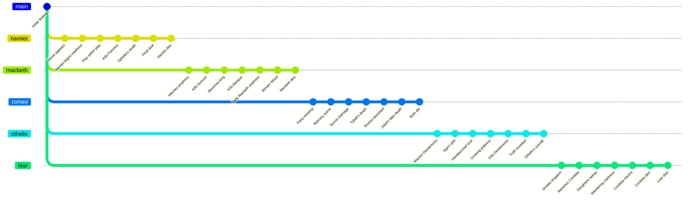

# AHOJ

bla bla 

```mermaid
gitGraph
    commit id: "Initial Setting"
    branch hamlet
    branch macbeth
    branch romeo
    branch othello
    branch lear
    
    checkout hamlet
    commit id: "Ghost appears"
    commit id: "Hamlet feigns madness"
    commit id: "Play within play"
    commit id: "Kills Polonius"
    commit id: "Ophelia's death"
    commit id: "Final duel"
    commit id: "Hamlet dies"
    
    checkout macbeth
    commit id: "Witches prophecy"
    commit id: "Kills Duncan"
    commit id: "Becomes king"
    commit id: "Kills Banquo"
    commit id: "Lady Macbeth madness"
    commit id: "Birnam Wood"
    commit id: "Macbeth dies"
    
    checkout romeo
    commit id: "Party meeting"
    commit id: "Balcony scene"
    commit id: "Secret marriage"
    commit id: "Tybalt's death"
    commit id: "Romeo banished"
    commit id: "Juliet's fake death"
    commit id: "Both die"
    
    checkout othello
    commit id: "Marries Desdemona"
    commit id: "Iago's plot"
    commit id: "Handkerchief trick"
    commit id: "Growing jealousy"
    commit id: "Kills Desdemona"
    commit id: "Truth revealed"
    commit id: "Othello's suicide"
    
    checkout lear
    commit id: "Divides kingdom"
    commit id: "Banishes Cordelia"
    commit id: "Daughters betray"
    commit id: "Wandering madness"
    commit id: "Cordelia returns"
    commit id: "Cordelia dies"
    commit id: "Lear dies"
```

bla bla
