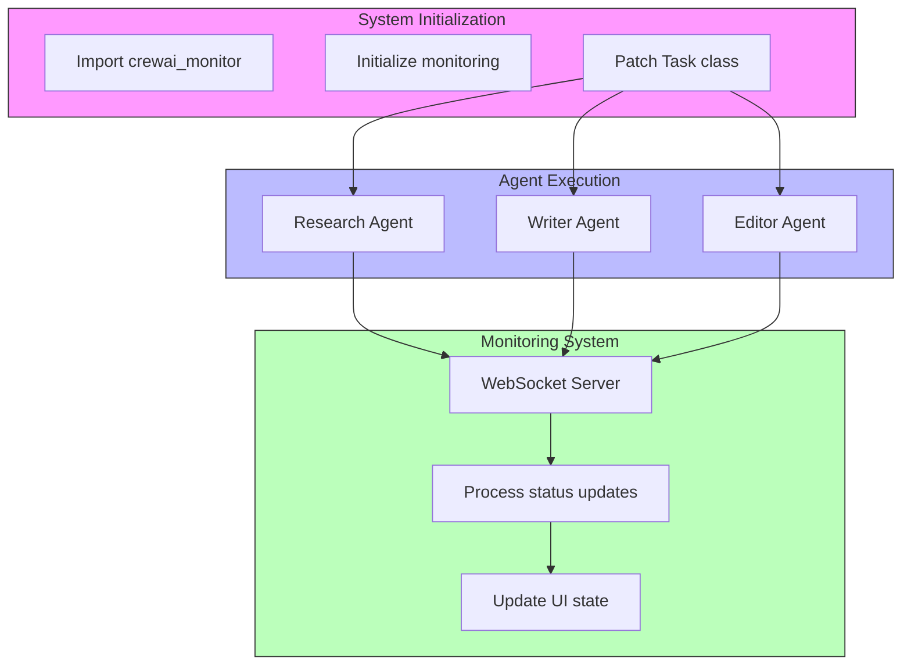
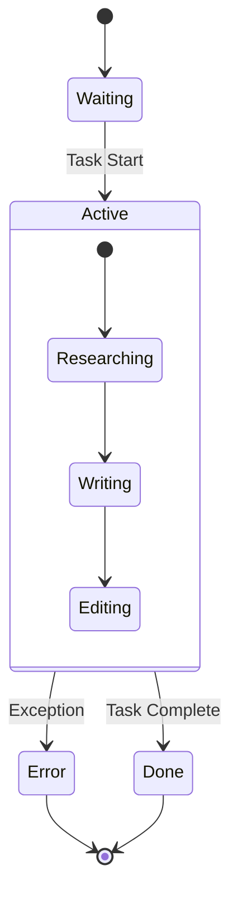

# CrewAI Monitoring System Architecture

## Overview

The CrewAI monitoring system provides real-time visibility into the execution of CrewAI agents and tasks. It uses a method patching approach to inject monitoring capabilities into the CrewAI framework without modifying its core code.

## System Components

### 1. Core Components
- `crewai_monitor.py`: The main monitoring system that patches CrewAI classes
- `content_creation_crew.py`: The main application that orchestrates the content creation process
- `agents/`: Directory containing agent definitions
- `tasks/`: Directory containing task definitions

### 2. Initialization Flow



## Monitoring Injection Process

1. **Initialization**
   ```python
   # In content_creation_crew.py
   import crewai_monitor
   crewai_monitor.init(topic=topic)
   ```

2. **Method Patching**
   ```python
   # In crewai_monitor.py
   def patch_crewai():
       from crewai import Task, Crew
       # Store original methods
       original_execute_async = Task.execute_async
       # Patch with monitored versions
       Task.execute_async = monitored_execute_async
       # ... similar for other methods
   ```

3. **Status Tracking**
   - Each agent's execution is wrapped with monitoring code
   - Status updates are sent at key points:
     - Task Start
     - Task Completion
     - Error States

## Agent Status Flow



## Integration with Agents and Tasks

### Agent Integration
- Agents (`agents/*.py`) are monitored through their task execution
- Each agent's status is tracked independently
- Status updates include:
  - Agent name
  - Current task
  - Execution state

### Task Integration
- Tasks (`tasks/content_tasks.py`) are wrapped with monitoring
- Each task execution generates status updates
- Task lifecycle events are captured:
  ```python
  # Example monitored task execution
  sync_send_status({
      "agent": agent_name,
      "task": task_type,
      "output": f"Starting {task_type.lower()} task"
  })
  ```

## WebSocket Communication

Status updates are sent to the UI via WebSocket:
```python
async def send_status_update(message):
    async with websockets.connect(config["ws_url"]) as websocket:
        await websocket.send(json.dumps(enhanced_message))
```

## Message Format

```json
{
    "agent": "Research Agent",
    "task": "Researching",
    "output": "Starting researching task",
    "timestamp": "2025-02-20T00:38:47.025249",
    "type": "status",
    "agent_state": {
        "name": "Research Agent",
        "status": "Researching",
        "role": "Research Agent"
    }
}
```

## Status Types

1. **System Status**
   - Connection
   - Starting
   - Done
   - Error

2. **Agent Status**
   - Researching
   - Writing
   - Editing
   - Done
   - Error

## Error Handling

The monitoring system includes comprehensive error handling:
- Task execution errors are caught and reported
- WebSocket connection issues are handled gracefully
- Status updates are queued and retried on failure 